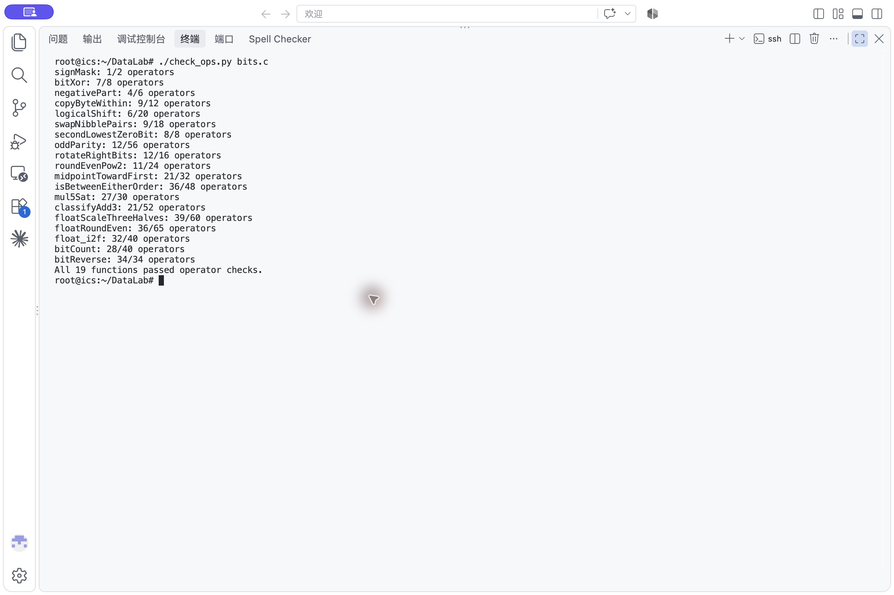
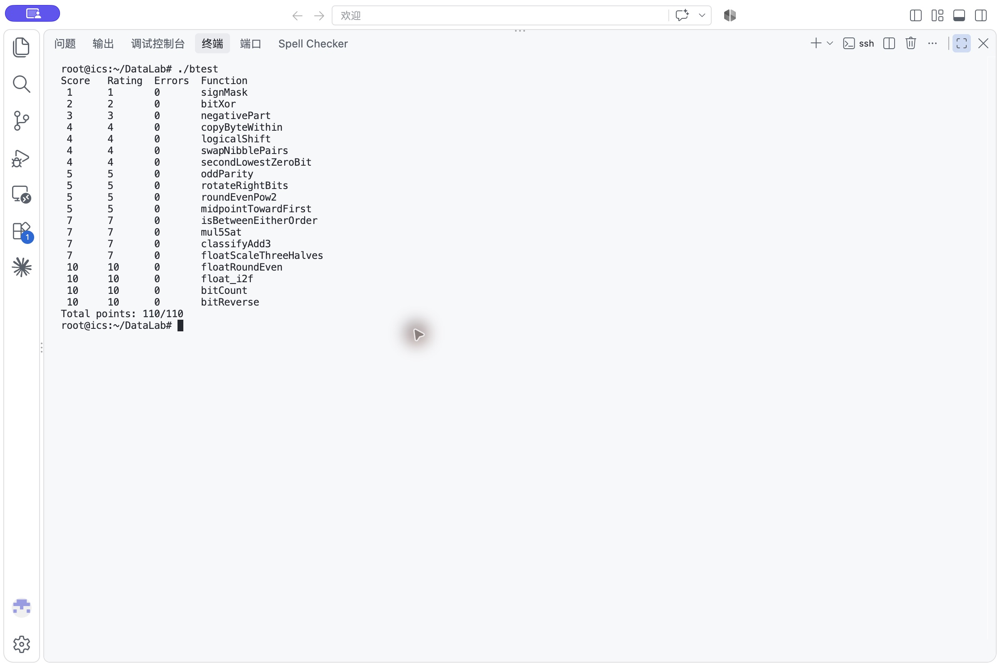

# Lab1：DataLab 实验报告

姓名：黄钰桐  
学号：24300810017

## 实验环境与结果

在 x86-64 Ubuntu 24.04 环境中，按课程仓库的 `Makefile` 使用 32 位编译选项构建。执行 `make clean && make all` 后，`./check_ops.py bits.c` 的 19 个函数全部通过运算符和操作数限制检查；`./btest` 的每题错误数均为 0，总分为 **110/110**。完整流程 `./test.sh` 返回成功。

### 运算符检查截图

### 正确性测试截图

## 逐题实现思路

### P1 `signMask`

将整数 1 左移 31 位，只在最高位留下 1，得到所需的符号位掩码。

### P2 `bitXor`

异或可以写成“至少有一个位为 1，且不能两个位同时为 1”。利用德摩根律，`~(~x & ~y)` 表示逐位或，再与 `~(x & y)` 相与。这样只使用题目允许的 `~` 和 `&`。

### P3 `negativePart`

算术右移 `x >> 31` 对负数产生全 1 掩码，对非负数产生全 0 掩码。先用 `~x + 1` 构造补码意义下的相反数，再用该掩码保留负数对应的结果。对 `INT_MIN` 也遵循题目规定的 32 位位向量语义。

### P4 `copyByteWithin`

字节编号乘 8 可得到位偏移。先右移并用 `255` 提取源字节；再把 `255` 移到目标位置，清除原目标字节，最后将源字节移入并合并。源、目标相同时也保持原值。

### P5 `logicalShift`

`x >> n` 在负数上会向高位补 1，因此需要额外清掉补入的位。`(1 << 31) >> n` 先形成高位连续 1，左移 1 后取反，得到低 `32-n` 位为 1 的掩码；它与算术右移的结果相与，就是逻辑右移。

### P6 `swapNibblePairs`

构造重复的 `0x0f` 掩码以选出每字节低半字节。低半字节左移 4 位，高半字节右移 4 位后再用同一掩码去掉算术右移可能引入的符号位，最后合并两部分。

### P7 `secondLowestZeroBit`

在 `~x` 中，原数的 0 位变成 1。用 `u & (~u + 1)` 取出最低的 1，再通过异或清除它；对剩余位重复同一操作，即取得原数第二低的 0 位。若不足两个 0 位，剩余值为 0，结果也为 0。

### P8 `oddParity`

依次把高 16、8、4、2、1 位的奇偶信息通过异或折叠到最低位。最低位最终为原数中 1 的个数模 2；题目要求偶数个 1 返回 1，因此将该位取反。

### P9 `rotateRightBits`

先用 `n & 31` 得到模 32 的有效旋转量。结果由逻辑右移的低位部分和左移 `32-k` 位的回绕部分按位或组成。左移量也按 32 取模，因此旋转 0 位时不会产生非法的 32 位移位。

### P10 `roundEvenPow2`

令 `q = x >> n`，目标倍数的间隔为 `2^n`。在移位截断前加上偏置 `2^(n-1)-1+(q&1)`：超过半程时进位；恰好半程时仅当 `q` 为奇数才进位。再右移、左移 `n` 位，得到最近且平局时商为偶数的倍数。

### P11 `midpointTowardFirst`

`(x & y) + ((x ^ y) >> 1)` 在不计算可能溢出的 `x+y` 的情况下得到数学中点的向下取整值。若两数奇偶性不同，中点在两个整数之间；此时仅当第一个参数 `x` 更大时加 1，使结果靠近 `x`。比较时先区分符号，再看差值的符号，避免差值溢出误判。

### P12 `isBetweenEitherOrder`

分别判断 `x >= a` 与 `x >= b`。比较先处理异号情形，同号时才利用差值符号，因此不会因减法溢出而改变结果。两个比较结果不同表示 `x` 严格处于端点之间；另外显式纳入 `x == a` 和 `x == b`，使边界与两端点相等的情况也正确。

### P13 `mul5Sat`

用 `(x << 2) + x` 计算低 32 位乘积。可安全乘 5 的范围为 `-0x19999999` 到 `0x19999999`，因此先根据输入和界值判断正向、负向溢出，再分别选择 `INT_MAX` 或 `INT_MIN`；未溢出时保留乘积。正负溢出掩码互斥，能够在不使用分支的前提下完成选择。

### P14 `classifyAdd3`

把每个整数拆成 `4*(x>>2)+(x&3)`。三个算术右移结果之和仍在 32 位有符号范围内，低两位之和也很小；将低位产生的进位加回高位，就得到精确总和除以 4 的向下取整值 `quarter`。若 `quarter >= 2^29`，精确和超过 `INT_MAX`；若 `quarter < -2^29`，则低于 `INT_MIN`；否则在范围内。

### P15 `floatScaleThreeHalves`

拆出符号、阶码和尾数字段；NaN 直接返回原编码。对普通数补上隐藏的最高有效位，对次正规数则不补。把整数有效位乘 3 后，根据是否跨过规格化边界右移 1 或 2 位，再用被丢弃的位执行最近偶数舍入。最后处理次正规数转正规数、有效位进位、阶码增加及溢出到无穷大等边界，始终保留原符号。

### P16 `floatRoundEven`

阶码较大时原值已是整数；绝对值小于 `0.5` 时返回带原符号的零；阶码对应 `[0.5,1)` 时单独处理 `0.5` 平局。其余情况按阶码计算小数位数，清掉小数位，并依据被清掉部分与半个单位的比较决定是否进位；平局时查看整数部分最低位。进位使有效位溢出时同步增加阶码。

### P17 `float_i2f`

先取符号和无符号绝对值，零单独返回。找到绝对值最高的 1 后即可确定浮点阶码；若整数有效位不超过 24 位，只需左移对齐。若位数更多，则右移保留 24 位有效位，并根据舍弃部分按最近偶数规则舍入；舍入产生新的最高位时增加阶码。

### P18 `bitCount`

采用分组计数：先用交错的 `0x55` 掩码统计每 2 位，再用 `0x33` 统计每 4 位、用 `0x0f` 统计每字节；随后逐步合并相邻字节和半字的计数。最后 6 位足以表示 0 到 32 的结果。

### P19 `bitReverse`

按 1、2、4、8、16 位的组宽依次交换相邻位组。各阶段的掩码从 `0x00ff00ff` 和移位异或构造，以控制交换范围并去掉算术右移的符号扩展。完成五个阶段后，原来的第 `i` 位移动到第 `31-i` 位。

## 参考资料

- [课程 Lab1：DataLab 实验文档](https://ics-26fall-fdu.github.io/labs/lab1-data-lab/)
- [实验模板仓库 `README.md`](https://github.com/ICS-26Fall-FDU/DataLab/blob/main/README.md) 及 `bits.c` 中的题目与编码规则
